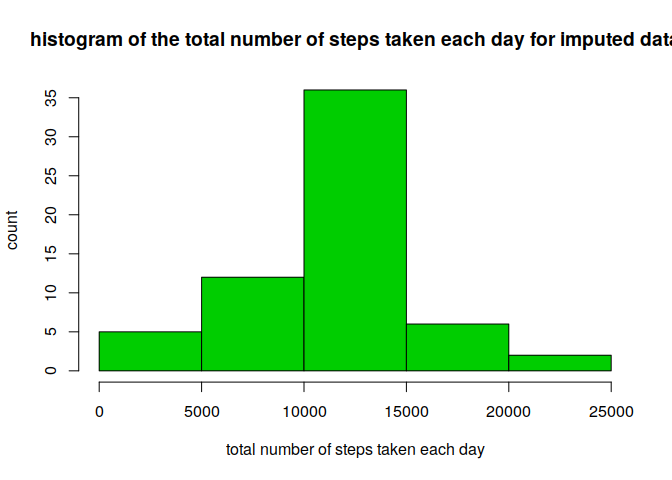

## Loading and preprocessing the data

I'm also loading library for easier data processing.


```r
library(dplyr)
```

Load the file into a data frame.


```r
raw_data <- read.csv(unz("activity.zip", "activity.csv"))
```

And remove rows without data.


```r
data <- na.omit(raw_data)
```

## What is mean total number of steps taken per day?


```r
steps <- data %>% 
            group_by(date) %>% 
            summarise(TotalSteps=sum(steps))

hist(steps$TotalSteps, 
     col=3,
     xlab="total number of steps taken each day", 
     ylab="count", 
     main="histogram of the total number of steps taken each day")
```

<!-- -->

Calculate the median and the mean of the steps per day:


```r
meanByDay <-  mean(steps$TotalSteps)
medianByDay <- median(steps$TotalSteps)
```

The median of steps by day is **10765**
and the mean is **10766.19**.


## What is the average daily activity pattern?


```r
averageStepsPerInterval <- data %>%
  group_by(interval) %>%
  summarize(AverageSteps = mean(steps))

plot(
  averageStepsPerInterval$interval,
  averageStepsPerInterval$AverageSteps,
  xlab="Interval",
  ylab="Average Number of Steps",
  main="Average Number of Steps In 5 Minute Intervals",
  type="l"
)
```

<!-- -->


```r
inervalWithMaxSteps <- averageStepsPerInterval %>%
  filter(AverageSteps == max(AverageSteps))
```

The interval with max steps is **835**, 
the average number of steps for this interval is **206.1698113**.


## Imputing missing values

1. Calculate and report the total number of missing values in the dataset (i.e. the total number of rows with `NA`s)


```r
numberOfRowsWithMissingValues <- sum(is.na(raw_data$steps))
```

The number of rows with missing data is **2304**.

2. Devise a strategy for filling in all of the missing values in the dataset. The strategy does not need to be sophisticated. For example, you could use the mean/median for that day, or the mean for that 5-minute interval, etc.

We could insert the missing data in multiple ways, e.g. we can use the mean
for the interval for other days.

3. Create a new dataset that is equal to the original dataset but with the missing data filled in.


```r
dataWithoutNA <- raw_data
for(i in 1:length(dataWithoutNA$steps)) { 
    if(is.na(dataWithoutNA[i,1])) {
        dataWithoutNA[i,1] = 
            averageStepsPerInterval[which(averageStepsPerInterval$interval == dataWithoutNA[i,3]),][[2]]

    }
}
```


4. Make a histogram of the total number of steps taken each day and Calculate and report the **mean** and **median** total number of steps taken per day. 


```r
stepsWithoutNA <- dataWithoutNA %>% 
            group_by(date) %>% 
            summarise(TotalSteps=sum(steps))

hist(stepsWithoutNA$TotalSteps, 
     col=3,
     xlab="total number of steps taken each day", 
     ylab="count", 
     main="histogram of the total number of steps taken each day for imputed data")
```

<!-- -->

Calculate the median and the mean of the steps per day:


```r
meanByDayWithoutNA <-  mean(stepsWithoutNA$TotalSteps)
medianByDayWithoutNA <- median(stepsWithoutNA$TotalSteps)
```

The median of steps by day is **10766.19**
and the mean is **10766.19**.

Do these values differ from the estimates from the first part of the assignment? What is the impact of imputing missing data on the estimates of the total daily number of steps?

Yes, they do. The mean is the the same in both cases, however the median is
slightly larger in case of the imputed data.

The total daily number of steps is of course much higher, what is visible on the histogram.
The total number of steps increased from **570608** to **656737.5**.
The **`0.5`** in the number of steps is caused by adding the average, which was no an integer in many cases.

## Are there differences in activity patterns between weekdays and weekends?


1. Create a new factor variable in the dataset with two levels -- "weekday" and "weekend" indicating whether a given date is a weekday or weekend day.

1. Make a panel plot containing a time series plot (i.e. `type = "l"`) of the 5-minute interval (x-axis) and the average number of steps taken, averaged across all weekday days or weekend days (y-axis). The plot should look something like the following, which was created using **simulated data**:

Let's create a new data frame and add there the day of week.

```r
weekDayData <- na.omit(raw_data)
weekDayData$date <- as.Date(weekDayData$date)
weekDayData$dow <- weekdays(weekDayData$date)
```

And let's make the charts:


```r
weekdayData <- weekDayData %>% 
  filter(!(dow %in% c("Saturday", "Sunday"))) %>% 
  group_by(interval) %>% 
  summarise(TotalSteps=sum(steps))

weekendData <- weekDayData %>% 
  filter(dow %in% c("Saturday", "Sunday")) %>% 
  group_by(interval) %>% 
  summarise(TotalSteps=sum(steps))

plot(
  weekdayData$interval,
  weekdayData$TotalSteps,
  xlab="Interval",
  ylab="Average Number of Steps",
  main="Average Number of Steps In 5 Minute Intervals For Weekdays",
  type="l"
)
```

<!-- -->

```r
plot(
  weekendData$interval,
  weekendData$TotalSteps,
  xlab="Interval",
  ylab="Average Number of Steps",
  main="Average Number of Steps In 5 Minute Intervals For Weekeds",
  type="l"
)
```

<!-- -->


